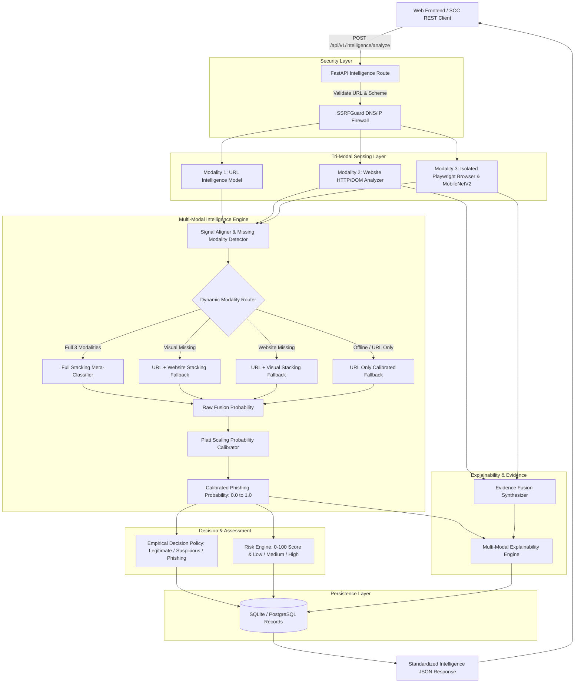
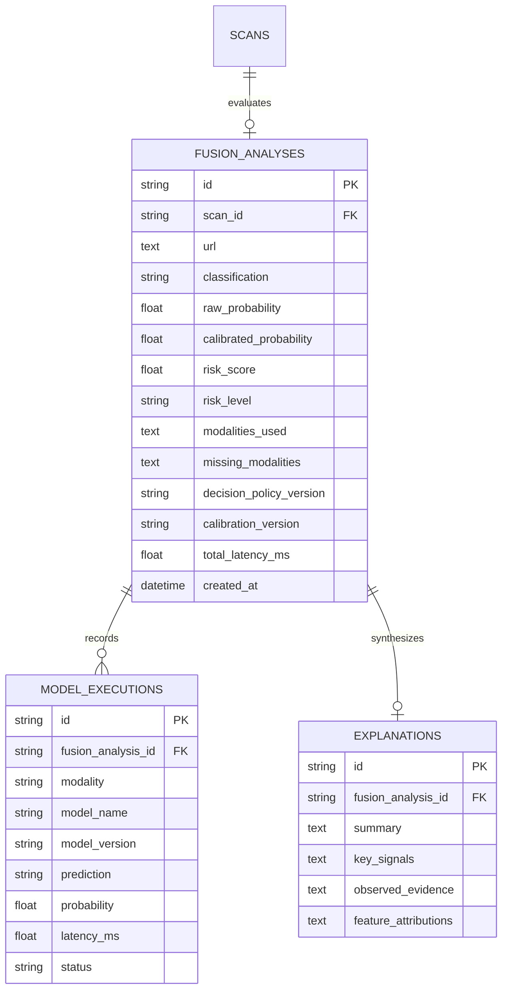

# PhishGuard AI — Intelligence Engine Architecture

## 1. High-Level System Architecture



---

## 2. Dynamic Fallback Routing Logic

The Stacking Meta-Classifier (`ml/fusion/models/stacking_model.py`) contains specialized sub-models fitted on corresponding training features:

| Available Modality State | Activated Sub-Model | Features Ingested | Routing Mode Tag |
| :--- | :--- | :--- | :--- |
| **URL + Website + Visual** | `sub_models['full']` | $[P_{\text{url}}, P_{\text{website}}, P_{\text{visual}}]$ | `full_multimodal_stacking` |
| **URL + Website** | `sub_models['url_website']` | $[P_{\text{url}}, P_{\text{website}}]$ | `url_website_stacking_fallback` |
| **URL + Visual** | `sub_models['url_visual']` | $[P_{\text{url}}, P_{\text{visual}}]$ | `url_visual_stacking_fallback` |
| **URL Only** | `sub_models['url_only']` | $[P_{\text{url}}]$ | `url_only_stacking_fallback` |

---

## 3. Database Schema



---

## 4. REST API Endpoints

### 4.1 Execute Multi-Modal Assessment
`POST /api/v1/intelligence/analyze`

**Request**:
```json
{
  "url": "https://netflix-billing-reactivation.com",
  "include_visual": true
}
```

**Response**:
```json
{
  "scan_id": "8e3b2e59-cfa0-4bb5-a35f-149b8d227b68",
  "url": "https://netflix-billing-reactivation.com",
  "status": "completed",
  "classification": "phishing",
  "phishing_probability": 0.9634,
  "risk_score": 96.3,
  "risk_level": "high",
  "modalities_used": ["url", "website", "visual"],
  "missing_modalities": [],
  "models": {
    "url": { "model_name": "RandomForest_URLLexical", "probability": 0.9055 },
    "website": { "model_name": "DOM_Form_HeuristicAnalyzer", "probability": 0.9707 },
    "visual": { "model_name": "PhishMobileNetV2_Transfer", "probability": 0.9302 },
    "fusion": { "routing_mode": "full_multimodal_stacking", "calibrated_probability": 0.9634 }
  },
  "evidence": [
    {
      "category": "forms",
      "severity": "critical",
      "title": "Cross-Domain Password Action",
      "description": "Form targets external domain."
    }
  ],
  "explanation": {
    "summary": "Multi-modal fusion estimated an elevated phishing probability of 96.3% based on convergent signals across url, website, visual.",
    "classification": "phishing"
  },
  "performance": { "total_analysis_ms": 142.5 }
}
```

### 4.2 Query Assessment Record
`GET /api/v1/intelligence/{scan_id}`
Returns previously computed assessment and auditable data.
