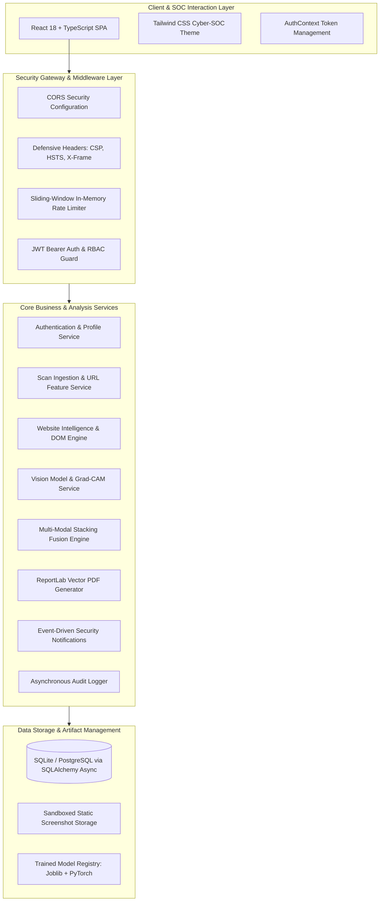

# PhishGuard AI — Platform Architecture

## Executive Overview
PhishGuard AI is an enterprise-grade cybersecurity web platform engineered for real-time detection, explainable classification, and audit-grade reporting of phishing websites. The system implements a decoupled, multi-tier SOC architecture integrating deep static URL analysis, browser DOM/HTML sandboxing, computer vision screenshot classification, and an empirical multi-modal stacking fusion engine.

---

## High-Level System Architecture

---

## Architectural Principles & Design Decisions

### 1. Zero-Trust Defensive Ingestion (SSRF Protection)
- Every submitted target is subjected to strict IP address resolution and protocol whitelisting prior to network dispatch.
- Loopback (`127.0.0.1/8`, `::1`), RFC 1918 private subnets (`10.0.0.0/8`, `172.16.0.0/12`, `192.168.0.0/16`), and link-local cloud metadata addresses (`169.254.169.254`) are immediately rejected with `400 Bad Request`.

### 2. Multi-Modal Modularity with Dynamic Fallback Routing
- The platform maintains four distinct AI/heuristic subsystems:
  - **URL Lexical Model**: 34 lexical and domain features evaluated via RandomForest / LightGBM.
  - **DOM & Website Telemetry**: 48 structural, script, iframe, and form features evaluated via deterministic heuristic scoring.
  - **Visual Model**: MobileNetV2 transfer learning with Grad-CAM visual heatmaps.
  - **Meta-Classifier Stacking**: Combines out-of-fold base model probabilities with Platt scaling.
- If target connectivity is severed or browser rendering fails, the pipeline degrades gracefully to available modalities without fabricating outputs.

### 3. Decoupled Presentation and Classification Policies
- **Classification Output**: Discrete calibrated assessment (`LEGITIMATE`, `SUSPICIOUS`, `PHISHING`) determined by validation-tuned decision boundaries ($\theta_{legit} \le 0.2181$, $\theta_{phish} \ge 0.6644$).
- **Risk Score Presentation**: Continuous calibrated scale ($0$ to $100$) mapped into standard operational severity levels (`LOW`, `MEDIUM`, `HIGH`).

### 4. Non-Repudiation & Audit Logging
- Every administrative action, scan creation, login attempt, and report download is permanently committed to the `audit_logs` table with client IP, timestamp, and action details.
