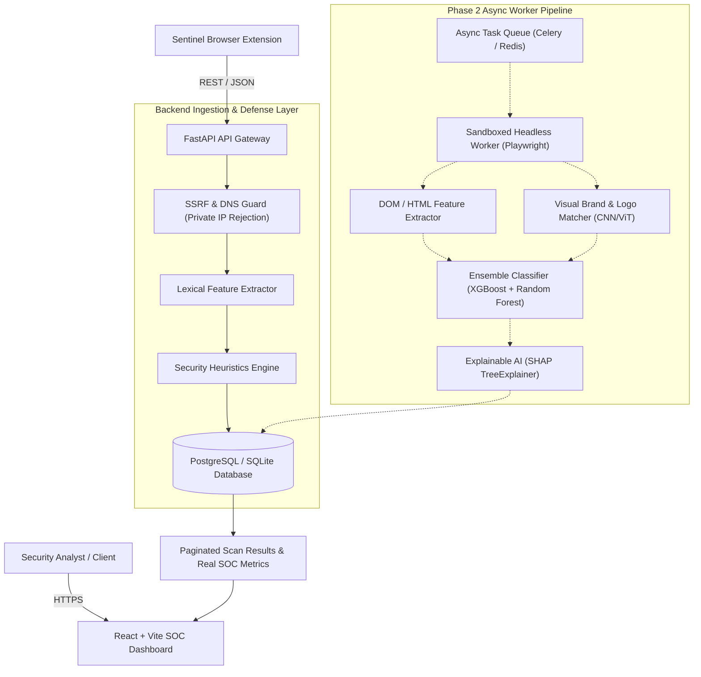

# PhishGuard AI - System Architecture Specification

## 1. High-Level Architecture Overview

**PhishGuard AI** ("Detect. Explain. Protect.") is architected as an enterprise-grade multi-tier cybersecurity intelligence and machine learning platform. It is engineered specifically for high reliability, verifiable academic rigor, and production scalability.

---

## 2. Component Breakdown

### 2.1 Frontend SOC Console
- **Stack**: React 18, TypeScript, Vite, Tailwind CSS, Lucide React, Recharts, Framer Motion.
- **Role**: Premium dark Security Operations Center (SOC) dashboard.
- **Integrity Guarantee**: All metric counters, threat graphs, and status indicators strictly represent genuine persisted data. No fabricated ML accuracy bars or fake scan states.

### 2.2 API & Ingestion Engine (FastAPI)
- **Asynchronous Architecture**: Handles concurrent URL ingestions with sub-second latency.
- **Defensive Ingestion**:
  - Validates protocol strictly (`http://` and `https://` only; blocks `file://`, `ftp://`, `javascript:`, `data:`).
  - Resolves domain to IP prior to connection.
  - Automatically aborts requests targeting private RFC 1918 subnets (`10.0.0.0/8`, `172.16.0.0/12`, `192.168.0.0/16`), loopback (`127.0.0.0/8`), link-local (`169.254.0.0/16`), or cloud metadata endpoints (`169.254.169.254`).
- **Feature Computation**: Deterministic extraction of 14+ lexical features and heuristic rule evaluation before queueing.

### 2.3 Relational Database Layer (SQLAlchemy 2.0)
- **Entities**:
  - `User`: Analysts, admins, authentication records.
  - `Scan`: Target URL, canonicalized URL, client footprint, status lifecycle (`queued` -> `processing` -> `completed` / `failed`).
  - `ScanResult`: Verdict (`legitimate`, `suspicious`, `phishing`, `unrated`), confidence score, risk score.
  - `URLFeatures`: Complete lexical vector for ML input.
  - `DomainInformation`: WHOIS, SSL certificate details, DNSSEC flags.
  - `HTMLFeatures`: Iframe counts, password form targets, script counts.
  - `VisualAnalysis`: Brand similarity and perceptual hashing.
  - `ThreatIndicator`: Actionable security findings with severity markers.

### 2.4 Browser Extension ("Sentinel")
- **Manifest V3**: Native Chromium extension for on-the-fly tab analysis and SOC synchronization.

---

## 3. Data Flow & Scan Lifecycle

1. **Submission**: Client submits a candidate URL via Dashboard, API, or Extension.
2. **Defensive Validation**:
   - URL length check (<= 2048 chars).
   - Protocol check (HTTP/HTTPS only).
   - SSRF resolution: DNS query resolves IP; if IP is in private/loopback range, HTTP 400 is returned immediately.
3. **Lexical Processing**:
   - URL components extracted via `tldextract`.
   - Structural features computed (Shannon entropy, dot count, hyphens, subdomains, etc.).
   - Initial heuristic rules evaluated (e.g. `@` token obfuscation, raw IP in host).
4. **Persistence**:
   - `Scan` created with status `queued`.
   - `URLFeatures` and `ThreatIndicator` records saved in DB.
   - Initial `ScanResult` created with verdict `unrated` and `confidence_score: None`.
5. **Phase 2 Expansion (Worker Pool)**:
   - Sandboxed browser loads page in isolated container.
   - DOM and screenshots captured.
   - ML model infers final probability and generates SHAP explanations.
   - Status updated to `completed`.
