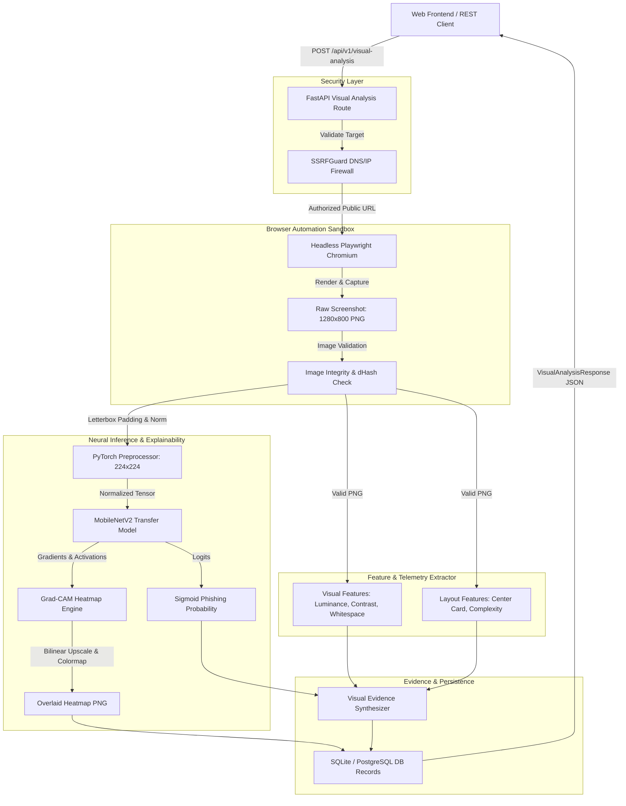
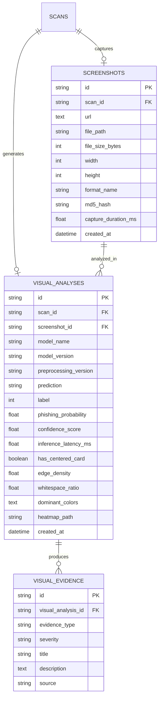

# PhishGuard AI — Visual Analysis Architecture & Pipeline Specification

## 1. High-Level Architecture Overview

Phase 4 introduces a dedicated computer vision pipeline operating parallel to the lexical URL analysis (Phase 2) and HTTP/DOM telemetry (Phase 3). 



---

## 2. Component Specifications

### 2.1 Screenshot Sandboxing (`backend/app/vision/screenshot_service.py`)
- **Engine**: Headless Playwright Chromium (`--no-sandbox`, `--disable-dev-shm-usage`, `--disable-gpu`).
- **Isolation**: Ephemeral browser contexts generated per invocation with clean cookie and cache stores.
- **SSRF Defense**: Target URL and resolved IP are validated prior to browser navigation; private subnets, loopback interfaces, and metadata addresses are rejected with HTTP 403.
- **Limits**: Standard viewport $1280 \times 800$, maximum timeout 8,000 ms, zero credential input or form interaction.
- **Storage**: Unique UUID naming stored in `backend/storage/screenshots/` and served via static route `/api/v1/screenshots/`.

### 2.2 Telemetry Extractors
- `VisualFeatureExtractor`: Computes mean luminance, RMS contrast, whitespace ratio ($>240$ RGB threshold), edge pixel density via Sobel/Laplacian convolution, Hasler-Süsstrunk colorfulness, and top dominant color clusters.
- `LayoutFeatureExtractor`: Segments viewport into vertical bands (header $0-20\%$, central body $20-80\%$, footer $80-100\%$) and detects central login card isolation patterns.

### 2.3 Deep Learning Inference (`backend/app/vision/visual_prediction_service.py`)
- Singleton service holding cached weights on CPU.
- Standardizes images via aspect-ratio preserving letterbox padding into $224 \times 224$ tensors with ImageNet mean $[0.485, 0.456, 0.406]$ and standard deviation $[0.229, 0.224, 0.225]$.
- Evaluates binary logits through sigmoid activation:
  $$\hat{y} = \sigma(z) \in [0.0, 1.0]$$
- Predicts `phishing` if $\hat{y} \ge 0.50$, else `legitimate`.

### 2.4 Visual Explainability Engine (`ml/vision/evaluation/explainability.py`)
- Hooks into feature map activations and backward gradients of the final convolutional layer (`backbone.features[-1]`).
- Pools spatial gradients to determine channel activation importance weights.
- Generates 2D activation maps, normalizes to $[0.0, 1.0]$, and blends with original screenshots using alpha blending ($\alpha = 0.45$).

---

## 3. Database Schema



---

## 4. API Endpoints

### 4.1 Trigger Visual Analysis
`POST /api/v1/visual-analysis`

**Request Body**:
```json
{
  "url": "https://netflix-billing-reactivation.com",
  "scan_id": "optional-uuid"
}
```

**Response Body**:
```json
{
  "status": "completed",
  "scan_id": "b73523f2-84f9-4171-8bc6-946f8279bb07",
  "prediction": "phishing",
  "label": 1,
  "phishing_probability": 0.9302,
  "confidence_score": 0.9302,
  "model_name": "MobileNetV2_Transfer",
  "model_version": "1.0.0",
  "preprocessing_version": "1.0.0",
  "inference_latency_ms": 18.06,
  "screenshot_url": "/api/v1/screenshots/netflix-sample.png",
  "heatmap_url": "/api/v1/screenshots/netflix-sample_heatmap.png",
  "visual_features": {
    "image_width": 1280,
    "image_height": 800,
    "aspect_ratio": 1.6,
    "mean_luminance": 0.124,
    "visual_contrast": 0.312,
    "whitespace_ratio": 0.08,
    "edge_density": 0.045,
    "colorfulness": 0.18,
    "dominant_colors": ["#141414", "#E50914"],
    "has_centered_card": true
  },
  "evidence": [
    {
      "evidence_type": "visual_model_signal",
      "severity": "critical",
      "title": "Strong Visual Similarity to Phishing Templates",
      "description": "Computer vision model (MobileNetV2_Transfer) produced a high phishing-class probability of 93.0%...",
      "source": "visual_classifier"
    }
  ]
}
```

### 4.2 Query Existing Visual Analysis
`GET /api/v1/visual-analysis/{scan_id}`
Returns cached visual classification, telemetry metrics, and Grad-CAM heatmap URLs.
