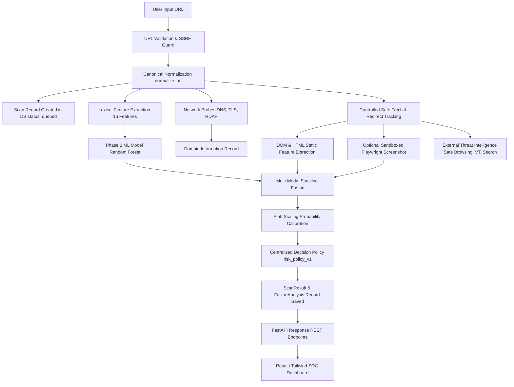

# Data Lineage & End-to-End Pipeline Architecture

**Product:** PhishGuard AI  
**Document:** Complete Data Lineage Traceability Matrix  
**Version:** 2.0.0

---

## 1. System Pipeline Overview



---

## 2. URL Identity Separation Model

To prevent semantic conflation and ambiguity across redirects and canonical links, PhishGuard AI enforces 4 distinct URL identities:

| URL Identity | Description | Database Column | API Field |
| :--- | :--- | :--- | :--- |
| **Original URL** | Raw, unedited string entered by the user or extension | `scans.url` | `original_url` |
| **Normalized URL** | Lowercased, scheme-enforced, port-stripped canonical URL | `scans.normalized_url` | `normalized_url` |
| **Final URL** | Actual destination URL reached after following all HTTP redirects | `scans.final_url` | `final_url` |
| **Canonical URL** | Declared authoritativeness via HTML `<link rel="canonical">` | `scans.canonical_url` | `canonical_url` |

---

## 3. Comprehensive Field Traceability Matrix

| UI Component / Screen | Display Field | Database Column | API Endpoint | Backend Function / Provider |
| :--- | :--- | :--- | :--- | :--- |
| **Header Badge** | Risk Score (0-100) | `scan_results.risk_score` | `GET /api/v1/intelligence/{id}` | `DecisionPolicyEngine.evaluate()` |
| **Header Badge** | Classification Verdict | `scan_results.verdict` | `GET /api/v1/intelligence/{id}` | `DecisionPolicyEngine.evaluate()` |
| **Header Badge** | Phishing Probability | `fusion_analyses.calibrated_probability` | `GET /api/v1/intelligence/{id}` | `ProbabilityCalibrator.calibrate()` |
| **Scan Header** | Input URL | `scans.url` | `GET /api/v1/scans/{id}` | `validate_and_sanitize_url()` |
| **Scan Header** | Final URL | `scans.final_url` | `GET /api/v1/scans/{id}` | `safe_http_fetch()` |
| **Scan Header** | Canonical URL | `scans.canonical_url` | `GET /api/v1/scans/{id}` | `extract_meta_tags()` |
| **Modality Card** | Lexical Model Probability | `model_execution_records.probability` | `GET /api/v1/intelligence/{id}` | `PredictionService.predict_url()` |
| **Modality Card** | Website / DOM Probability | `model_execution_records.probability` | `GET /api/v1/intelligence/{id}` | `WebsiteAnalysisService.analyze_url()` |
| **Modality Card** | Visual Model Probability | `model_execution_records.probability` | `GET /api/v1/intelligence/{id}` | `VisualPredictionService.analyze_image()` |
| **Threat Intel** | Safe Browsing Match | `scan_evidence.status` | `GET /api/v1/intelligence/{id}` | `GoogleSafeBrowsingClient.check()` |
| **Threat Intel** | VirusTotal Detections | `scan_evidence.status` | `GET /api/v1/intelligence/{id}` | `VirusTotalClient.check()` |
| **Threat Intel** | Google Search Presence | `scan_evidence.status` | `GET /api/v1/intelligence/{id}` | `GoogleSearchClient.check()` |
| **Domain Card** | Resolved IP Addresses | `domain_information.nameservers` | `GET /api/v1/scans/{id}` | `NetworkAnalyzer.resolve_dns()` |
| **Domain Card** | TLS Issuer & Expiry | `domain_information.ssl_issuer` | `GET /api/v1/scans/{id}` | `NetworkAnalyzer.inspect_tls_certificate()` |
| **Domain Card** | Registrar & Domain Age | `domain_information.domain_age_days` | `GET /api/v1/scans/{id}` | `NetworkAnalyzer.query_rdap()` |
| **Reproducibility** | URL Feature Hash | `scan_results.url_feature_hash` | `GET /api/v1/scans/{id}` | `compute_feature_hash()` |
| **Reproducibility** | DOM Snapshot Hash | `scan_results.dom_snapshot_hash` | `GET /api/v1/scans/{id}` | `compute_snapshot_hash()` |
| **Reproducibility** | Model Prediction Hash | `scan_results.prediction_hash` | `GET /api/v1/scans/{id}` | `compute_prediction_hash()` |

---

## 4. Scan ID Isolation & Anti-Contamination Invariant

All REST endpoints (`/api/v1/scans/{id}`, `/api/v1/intelligence/{id}`, `/api/v1/analyze/{id}`) execute strictly parameterized queries:
```sql
SELECT * FROM fusion_analyses WHERE scan_id = :scan_id;
```
If a scan record has not completed execution or possesses no fusion record, the endpoint strictly returns `HTTP 404 Not Found`. Cross-scan fallback queries searching by URL (`WHERE url = :url ORDER BY created_at DESC LIMIT 1`) are strictly prohibited to ensure concurrent scans and repeat scans maintain complete data integrity.
