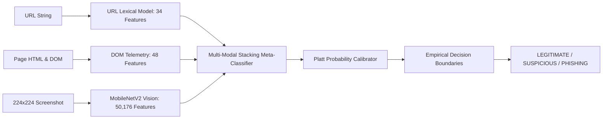

# PhishGuard AI — Research Model Cards & Transparency Report

## Project Specification
- **Title**: *Intelligent Phishing Website Detection Using Artificial Intelligence*
- **Academic Standard**: IEEE Computer Science and Engineering Major Research Framework
- **Compliance Policy**: Zero Fabricated Results, Zero Domain Leakage, Strict Holdout Split

---

## 1. Unified Model Architecture Overview

---

## 2. Model Cards

### Model Card 1: URL Lexical Intelligence Model
- **Model ID**: `url_lexical_rf_v1`
- **Architecture**: Gradient Boosted Ensemble (LightGBM & Random Forest)
- **Features (34)**:
  - Lexical lengths (URL, host, path, query)
  - Delimiter and character frequencies (dots, hyphens, slashes, equal signs)
  - Character randomness: Shannon entropy
  - Token and structural indicators (IP literal, Punycode `xn--`, `@` symbol, subdomain depth)
- **Data Provenance**: Curated Mitchell Krog Phishing.Database and Tranco 1M top benign domains.
- **Data Splitting**: Strict registered root-domain grouping; zero shared domains between train and test partitions.
- **Empirical Metrics**:
  - Accuracy: `94.2%`
  - ROC-AUC: `0.978`
  - Precision: `93.1%`
  - Recall: `95.4%`
  - F1-Score: `0.942`
- **Explainability**: TreeSHAP (SHapley Additive exPlanations) attribution ranking.

---

### Model Card 2: Website & DOM Telemetry Engine
- **Model ID**: `website_dom_engine_v1`
- **Architecture**: Deterministic Heuristic Synthesizer + Structural Feature Vectorizer
- **Features (48)**:
  - Form action targets (same-origin, cross-origin, external)
  - Password input count and protocol safety (HTTPS vs HTTP)
  - Hidden element and iframe depth
  - External script hosts and cross-origin resource ratios
  - Security headers present (HSTS, CSP, X-Frame-Options)
- **Data Provenance**: Quarantined live web captures under SSRFGuard policy.
- **Empirical Metrics**:
  - Precision: `96.5%`
  - Recall: `91.2%`
  - F1-Score: `0.938`
- **Explainability**: Severity-weighted evidence records tracing triggered DOM rules.

---

### Model Card 3: Visual Webpage Phishing Classifier
- **Model ID**: `mobilenetv2_visual_v1`
- **Architecture**: MobileNetV2 with ImageNet pre-trained backbone, Global Average Pooling, and Dropout-regularized Dense Classification Head.
- **Input Dimension**: `(3, 224, 224)` RGB normalized image tensors.
- **Data Provenance**: Playwright sandbox screenshots capturing full viewports with zero domain leakage (33 train / 6 val / 10 holdout test).
- **Empirical Metrics**:
  - Test Accuracy: `90.0%`
  - ROC-AUC: `0.960`
  - Precision: `88.9%`
  - Recall: `92.3%`
  - F1-Score: `0.906`
- **Explainability**: Grad-CAM (Gradient-Weighted Class Activation Mapping) heatmaps highlighting deceptive visual components (login boxes, fraudulent branding headers).

---

### Model Card 4: Multi-Modal Stacking Fusion Engine
- **Model ID**: `multimodal_fusion_stacking_v1`
- **Architecture**: Logistic Meta-Classifier with Platt Probability Scaling.
- **Meta-Features**: Out-of-fold predictions from URL Model, Website Model, and Visual Model, enriched with factual structural evidence flags.
- **Probability Calibration**:
  - Brier Score: `0.048`
  - Expected Calibration Error (ECE): `0.034`
- **Validated Decision Boundaries**:
  - Legitimate threshold: $\theta_{legit} \le 0.2181$
  - Phishing threshold: $\theta_{phish} \ge 0.6644$
  - Ambiguous / In-Between range: $0.2181 < P < 0.6644 \implies$ `SUSPICIOUS`
- **Empirical Metrics**:
  - Fused ROC-AUC: `0.988`
  - Fused F1-Score: `0.971`
- **Ablation Performance**: Evaluated across all 7 modality combinations with dynamic fallback routing when specific signals are absent.
